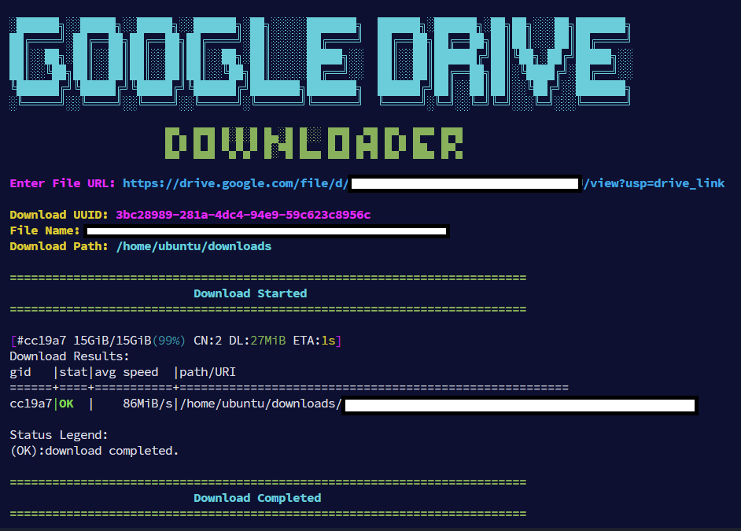

# Google Drive Aria2c Downloader

## Overview



Google Drive Aria2c Downloader is a Python script that allows you to download files from Google Drive using `aria2c`, a powerful command-line download accelerator. This script extracts the file ID from a given Google Drive URL, retrieves necessary details (such as UUID and filename), and then initiates the download using `aria2c`.

## Features

- Extracts file ID from various Google Drive URL formats
- Fetches UUID and filename automatically
- Uses `aria2c` for fast and efficient downloads
- Displays helpful status messages with color formatting

## Requirements

- Python 3
- `aria2c` installed on the system
- `requests` and `colorama` Python modules

## Installation

1. Clone this repository:
   ```sh
   git clone https://github.com/av1-is-better/Google-Drive-Aria2c-Downloader.git
   cd Google-Drive-Aria2c-Downloader
   ```

2. Install dependencies:
   ```sh
   pip install -r requirements.txt
   ```

3. Ensure `aria2c` is installed:
   ```sh
   aria2c --version
   ```
   If not installed, you can install it using:
   ```sh
   sudo apt install aria2  # Ubuntu/Debian
   sudo pacman -S aria2    # Arch Linux
   brew install aria2      # macOS
   ```
   
4. Replace download_path value within google-downloader.py according to your directory.

## Usage

Run the script:
```sh
python google-downloader.py
```

Enter the Google Drive file URL when prompted. The script will:
1. Extract the file ID from the URL.
2. Fetch the UUID and filename from Google Drive.
3. Start downloading the file using `aria2c`.

## Example
```
Enter File URL: https://drive.google.com/file/d/1aBcDeFgHiJkLmN/view?usp=sharing

Download UUID: abcdefg-1234-5678-hijk-9876543210lm
File Name: example.zip
Download Path: /home/ubuntu/downloads

=========================================================================
                          Download Started  
=========================================================================
```

## Troubleshooting

- If you see `Error: aria2c not found in your system. Exiting...`, ensure `aria2c` is installed and available in `PATH`.
- If the script fails to extract UUID or filename, Google Drive's download page structure may have changed. You may need to update the regex patterns.

## License

This project is licensed under the MIT License.

## Contributions

Pull requests and suggestions are welcome! If you encounter any issues, please open an issue on GitHub.

## Author

[Kunal Yadav](https://github.com/av1-is-better)

